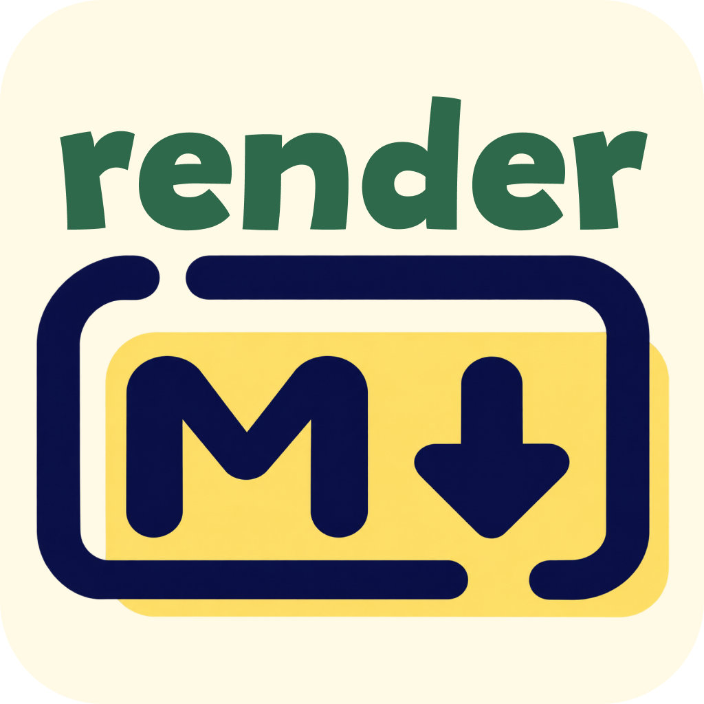

<div align="center">


<hr />

**rendermd is the local-first Markdown studio with unified design presets for typography, LaTeX math, and Mermaid diagrams.**

[](https://nextjs.org/)
[](https://react.dev/)
[](https://www.typescriptlang.org/)
[](https://tailwindcss.com/)
[](LICENSE)

[Live Demo](https://rendermd.vercel.app) • [Features](#-key-features) • [Presets](#-unified-design-presets) • [Architecture](#-architecture--pipeline) • [Contributing](CONTRIBUTING.md)

</div>

---

## Why rendermd?

Traditional Markdown renderers assemble independent libraries: standard Markdown looks one way, KaTeX equations look another, and Mermaid diagrams look like an alien widget pasted onto the page.

**rendermd** unifies everything under a **cohesive Design Token System**. When you switch presets, typography, margins, code fences, LaTeX equations, and Mermaid diagrams all transform seamlessly together.

```text
                    ┌───────────────────────────────┐
                    │    Markdown Source + AST      │
                    └───────────────┬───────────────┘
                                    │
             ┌──────────────────────┼──────────────────────┐
             ▼                      ▼                      ▼
        Markdown + GFM          KaTeX Math          Mermaid SVG
        Alerts, Tables, Code    Inline & Display    Lazy Loaded
             │                      │                      │
             └──────────────────────┼──────────────────────┘
                                    ▼
                         ┌────────────────────┐
                         │   Preset Engine    │
                         │   --md-* CSS Vars  │
                         └──────────┬─────────┘
                                    ▼
                         ┌────────────────────┐
                         │ Canonical Document │
                         └──────────┬─────────┘
                                    │
              ┌─────────────┬───────┴───────┬─────────────┐
              ▼             ▼               ▼             ▼
       Standalone HTML   Vector PDF     2x PNG/SVG    Rich-Text
```

---

## Key Features

- **Unified Preset Engine**: Switch between 6 curated document styles (**Minimal**, **GitHub**, **Academic**, **Technical**, **Midnight**, **Editorial**) or build your own with the live **Custom Theme Studio**.
- **Lazy-Loaded Engines**: Heavy libraries like `mermaid` and syntax highlighters are dynamically imported on-demand to keep initial load times under 100ms.
- **GitHub-Flavored Markdown**:
  - Full support for **GitHub Alert Callouts** (`[!NOTE]`, `[!TIP]`, `[!IMPORTANT]`, `[!WARNING]`, `[!CAUTION]`).
  - GFM Tables with zebra-striping, Task lists (`[x]`), and Footnotes (`[^1]`).
- **Publication-Grade LaTeX (KaTeX)**: Lightning-fast inline equations ($\nabla \cdot \mathbf{E} = \frac{\rho}{\varepsilon_0}$) and display formulas ($\int_{-\infty}^\infty e^{-x^2} dx = \sqrt{\pi}$).
- **Interactive Diagram Inspector**: Fullscreen canvas with pan, zoom (40%–250%), dot grid blueprint, and instant SVG/PNG exports.
- **100% Local-First & Zero-Backend**: All documents and custom themes persist in `localStorage`. Works offline without accounts or telemetry.
- **Multi-Format Exporter**:
  - **Standalone HTML**: Single self-contained file with embedded fonts, CSS variables, and vector SVGs.
  - **Print-Optimized PDF**: `@media print` layout respecting A4, US Letter, and Continuous page dimensions.
  - **High-Res PNG / SVG**: 2x retina snapshots via `html-to-image`.
  - **Formatted Rich-Text Copy**: Paste directly into Google Docs, Word, or Notion with styles intact.

---

## Unified Design Presets

| Preset        | Character & Typography                                       | Best Suited For                                |
| :------------ | :----------------------------------------------------------- | :--------------------------------------------- |
| **Minimal**   | Apple / Craft aesthetic, slate accents, spacious whitespace  | Essays, notes, clean documentation             |
| **GitHub**    | Authentic GitHub Markdown, system fonts, crisp callouts      | Open source docs, READMEs, changelogs          |
| **Academic**  | Newsreader serif paper, comfortable reading line-height      | Research papers, scientific articles, formulas |
| **Technical** | JetBrains Mono headings, cyan accents, dense layout          | RFCs, API specifications, system architecture  |
| **Midnight**  | Glowing dark canvas, luminous indigo/violet accents          | Developer specs, night mode reading            |
| **Editorial** | Warm ivory paper, terracotta accents, magazine elegance      | Longform essays, articles, publishing          |
| **Custom**    | Real-time interactive studio (color pickers, font selectors) | Custom branding and exportable theme JSONs     |

---

## Quick Start

### Prerequisites

- Node.js `18.18+` or `20+`
- [pnpm](https://pnpm.io/) `10+` (recommended)

### Installation

```bash
# Clone the repository
git clone https://github.com/sujeetgund/rendermd.git
cd rendermd

# Install dependencies
pnpm install

# Start development server
pnpm dev
```

Open [http://localhost:3000](http://localhost:3000) in your browser.

### Production Build

```bash
# Verify type safety and generate static production bundle
pnpm build

# Start production server
pnpm start
```

---

## Tech Stack

- **Framework**: [Next.js 16](https://nextjs.org/) (App Router, Turbopack)
- **UI & Primitives**: [Tailwind CSS v4](https://tailwindcss.com/) + [shadcn/ui](https://ui.shadcn.com/)
- **Markdown Parsing**: [`react-markdown`](https://github.com/remarkjs/react-markdown) + [`remark-gfm`](https://github.com/remarkjs/remark-gfm) + [`remark-github-blockquote-alert`](https://github.com/jaywcjlove/remark-github-blockquote-alert)
- **Mathematical Rendering**: [`rehype-katex`](https://github.com/remarkjs/remark-math) + [`katex`](https://katex.org/)
- **Diagrams**: [`mermaid`](https://mermaid.js.org/) (Dynamic on-demand import)
- **Syntax Highlighting**: [`prismjs`](https://prismjs.com/)
- **Image Capture**: [`html-to-image`](https://github.com/bubkoo/html-to-image)
- **Icons**: [`lucide-react`](https://lucide.dev/)

---

## Contributing 🤝

We welcome contributions from the community! Please read our **[CONTRIBUTING.md](CONTRIBUTING.md)** for our development standards, code style, and **strict dependency policy**.

> [!IMPORTANT]
> To keep `rendermd` ultra-lightweight and fast, any PR adding new dependencies to `package.json` must provide an explicit justification in the PR description explaining why native browser APIs or existing utilities were insufficient.

---

## License

`rendermd` is open-source software licensed under the [MIT License](LICENSE).
